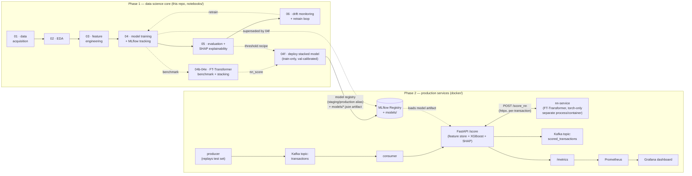

# Real-Time Fraud Detection & Risk Scoring Platform

An end-to-end fraud/risk-scoring system built the way production ML teams (e.g. Stripe
Radar, Sift, Feedzai) actually build them: real transaction data → leakage-safe feature
engineering → tracked model experimentation → business-cost-driven decision thresholds →
SHAP explainability → drift monitoring and an automated retrain-and-validate loop.

## Why fraud detection (not churn / loan default)

Fraud/risk scoring is one of the few ML problem classes that forces you to demonstrate
*every* layer of the stack at once: adversarial, severely imbalanced data; features that
must be computed **causally** (no peeking at the future) because they'll run in a live
scoring path; a decision threshold that has to be justified in dollars, not F1 score; and
monitoring that has to assume the population you're modeling is actively trying to evade
you. It's also not an artificial exercise — Stripe Radar, Sift, and Feedzai all publish
architecture write-ups describing this exact ingestion → feature engineering → training →
deployment → monitoring → retraining loop.

## Data

Real transaction data — the *Credit Card Transactions Fraud Detection Dataset*, originally
published on Kaggle as `kartik2112/fraud-detection` (CC0 1.0), generated with the
open-source **Sparkov Data Generation** tool: ~1,000 simulated customer profiles
transacting against ~700 merchants, with real (non-PCA) fields — timestamp, merchant,
category, amount, and genuine latitude/longitude for both the cardholder and the merchant
on every row. The public mirror this project downloads from (see notebook 01) carries
~1.05M transactions spanning January 2019 – March 2020.

Chosen deliberately over the two more common defaults: the ubiquitous ULB
`creditcard.csv` (features are anonymized PCA components `V1`...`V28`, which kills any
real feature-engineering or SHAP story), and IEEE-CIS Fraud Detection (richer, but gated
behind joining a Kaggle competition). Notebook 01 downloads this dataset from a public,
unauthenticated mirror, so the pipeline runs without a Kaggle account. Full provenance and
license details are documented there.

**Note on demographic fields**: the raw data includes `gender`, `age`, `job`, and
`city_pop`. These are used for descriptive EDA only and are **deliberately excluded** from
the model's feature set — using demographic/socioeconomic proxies in a fraud or credit-risk
model creates real disparate-impact exposure, and a production fraud team would need a
documented governance review before ever using them.

## Project status

**Phase 1 (complete): the data science core**, built and executed as Jupyter notebooks —
see [`notebooks/`](notebooks/). **Phase 2 (built, being verified end-to-end): production
services** — a real-time FastAPI scoring API, a Kafka-based streaming pipeline, and
Prometheus/Grafana monitoring, wired together with Docker Compose — see
[Phase 2](#phase-2-production-services) below.

## Notebooks

| # | Notebook | What it does |
|---|----------|---------------|
| 01 | [`data_acquisition`](notebooks/01_data_acquisition.ipynb) | Downloads and cleans the real Sparkov/kartik2112 transaction dataset, documents provenance/license, builds `users`/`merchants` reference tables, and works out (empirically) which geo signal is actually well-grounded in this data |
| 02 | [`eda`](notebooks/02_eda.ipynb) | Class imbalance, temporal patterns across the real Jan 2019 – Mar 2020 window, amount distributions, merchant-category risk, distance-from-home signal |
| 03 | [`feature_engineering`](notebooks/03_feature_engineering.ipynb) | Leakage-safe, causally-computed features: rolling per-card velocity (1h/24h/7d), **merchant-side velocity (1h)**, expanding amount z-score, category novelty, real distance-from-home, smoothed target encoding for merchant/category risk. Chronological train/val/test split |
| 04 | [`model_training`](notebooks/04_model_training.ipynb) | Class-weighted logistic regression + **Random Forest** baselines, then an XGBoost hyperparameter sweep (including a **regularization pass** — `subsample`/`colsample_bytree`/`min_child_weight`/`reg_lambda`), every run tracked in **MLflow** (SQLite-backed, full Model Registry), best model promoted to the `staging` alias |
| 04b | [`neural_network_benchmark`](notebooks/04b_neural_network_benchmark.ipynb) | Trains an **FT-Transformer** (Gorishniy et al. 2021) from scratch in PyTorch on the same causal features, as an honest benchmark against XGBoost rather than a default choice — see [Neural network benchmark](#neural-network-benchmark-ft-transformer-vs-xgboost) below |
| 04c | [`neural_network_vs_xgboost_comparison`](notebooks/04c_neural_network_vs_xgboost_comparison.ipynb) | Head-to-head test-set comparison of the deployed XGBoost model against the FT-Transformer, plus the reasoning for keeping XGBoost deployed anyway |
| 04d | [`compute_nn_scores`](notebooks/04d_compute_nn_scores.ipynb) | Scores every transaction the FT-Transformer didn't train on with its predicted probability, for use as a stacking feature |
| 04e | [`stacked_xgboost`](notebooks/04e_stacked_xgboost.ipynb) | Trains XGBoost on the original features **plus** the FT-Transformer's score — model stacking, evaluated the same way as every other model here (research config: trains on `train_holdout+val`, not deployment-safe) |
| 04f | [`deploy_stacked_model`](notebooks/04f_deploy_stacked_model.ipynb) | **Deploys** the stacked model: retrains on `train_holdout` only (keeping `val` clean), re-runs notebook 05's full threshold-calibration recipe against it, evaluates on `test`, and writes the artifacts `src/api/` actually serves — see [Deploying the stack](#deploying-the-stack-a-two-process-architecture-and-why-its-safe-now) below |
| 05 | [`model_evaluation_explainability`](notebooks/05_model_evaluation_explainability.ipynb) | Hold-out test evaluation (ROC-AUC, PR-AUC), a **specificity-targeted, category-aware decision threshold** (see [Decision threshold design](#decision-threshold-design) below), precision at a fixed daily review budget, recall by category / distance-from-home, and **SHAP** global + individual-transaction explanations |
| 06 | [`drift_monitoring`](notebooks/06_drift_monitoring.ipynb) | PSI/KS-test drift detection on the *real* train→test calendar window, a simulated adversarial shift (a fraud ring adapting to evade the model's top SHAP features), a label-free + performance-based retrain trigger, and an automated retrain → validate → promote step |
| 07 | [`error_analysis`](notebooks/07_error_analysis.ipynb) | On the **validation set**: near-miss vs. confidently-wrong false negatives, feature-distribution comparison across confusion-matrix outcomes, and mean-SHAP-value gap between caught and missed fraud — see [Error analysis](#error-analysis) below |
| 07b | [`error_analysis_shopping_pos`](notebooks/07b_error_analysis_shopping_pos.ipynb) | Deep-dive on the single highest-leverage remaining category — finds large-amount fraud overlapping a legitimate long tail, not the low-amount blind spot found globally — see [Deep-dive: shopping_pos](#deep-dive-shopping_pos-the-highest-leverage-remaining-category) below |

## Decision threshold design

The decision threshold went through three rounds of correction after the initial pass,
documented here because the reasoning generalizes beyond this project. **The specific
numbers below are from the model as it stood at the end of round 3** — the model and
thresholds were updated again after this (new `merchant_txn_count_1h` feature +
regularization; see [Acting on the error analysis](#acting-on-the-error-analysis) for the
current numbers) — but the methodology in each round is unchanged and still what's running.

### 1. Cost-minimization alone flagged too many good customers

Notebook 05 originally chose the threshold that **minimizes total expected dollar cost**
(missed-fraud $ loss vs. $5 false-alarm review cost). Because a missed fraud costs far more
than a $5 review, that objective pushed the threshold down to **0.01** — technically
cost-optimal, but it meant flagging a large share of legitimate transactions just to shave
a few more dollars off missed fraud, which is not a trade-off a real risk team would accept
(customer friction and support load aren't in the dollar model).

**Fix:** the deployed threshold now targets a fixed **98% specificity** on legitimate
transactions — at most 2% of good customers get flagged — and picks the highest-recall
threshold that still satisfies it. The cost-minimizing threshold (`0.01`) is kept in
`reports/evaluation_summary.json` as `cost_minimizing_threshold_reference` for comparison,
not used for the actual decision.

| | cost-minimizing (old) | specificity-targeted (new) |
|---|---|---|
| decision threshold | 0.01 | 0.046 |
| specificity (good customers correctly cleared) | much lower | 98.0% |
| fraud recall | ~92%+ | 85.5% |
| est. savings vs. no model | $465,488 | $460,909 |

A ~$4,600/year difference in modeled savings for a large reduction in customer friction.

### 2. A single global threshold miscalibrated recall across merchant categories

At the single 98%-specificity threshold, recall by merchant category ranged from **11.8%**
(`grocery_net`) to **98.5%** (`misc_net`) — not because the model was uniformly worse at
some categories, but because `category_fraud_rate_prior` (a feature) shifts each category's
whole score distribution up or down. One fixed cutoff over-penalizes categories with a
naturally lower baseline score and under-penalizes categories with a naturally higher one —
the same failure mode addressed by *group-aware threshold calibration* in the imbalanced-
classification literature (e.g. "Beyond Synthetic Augmentation: Group-Aware Threshold
Calibration for Robust Balanced Accuracy in Imbalanced Learning", arXiv:2509.02592).

**Fix:** notebook 05 now calibrates a **per-category threshold**, each targeting the same
98% specificity constraint, on the **validation set** (not test — test stays reserved for
the final, unbiased evaluation). The initial fallback guard (< 1,000 legit transactions in
validation) never actually fired — see [§3](#3-the-per-category-calibration-itself-was-overfit-for-low-fraud-count-categories)
for why that guard was checking the wrong quantity and how it was replaced. The serving API
(`src/api/model.py`, `src/api/main.py`) applies the matching category threshold per incoming
transaction, falling back to the global threshold for unseen categories.

| category | recall @ global threshold | recall @ category-aware threshold | Δ |
|---|---|---|---|
| health_fitness | 26.7% | **73.3%** | +46.7pp |
| grocery_net | 11.8% | **52.9%** | +41.2pp |
| personal_care | 75.0% | 95.8% | +20.8pp |
| food_dining | 55.0% | 70.0% | +15.0pp |
| kids_pets | 64.5% | 74.2% | +9.7pp |
| home | 86.7% | 93.3% | +6.7pp |
| entertainment | 89.3% | 100% | +10.7pp |
| gas_transport | 91.2% | 100% | +8.8pp |
| grocery_pos | 90.9% | 99.6% | +8.7pp |
| shopping_net | 97.7% | 97.7% | — |
| misc_net | 98.5% | 94.2% | −4.4pp |
| shopping_pos | 80.2% | 61.5% | −18.8pp |
| misc_pos | 42.9% | 32.1% | −10.7pp |
| travel | 28.6% | 21.4% | −7.1pp |

Overall recall improved (85.5% → 88.5%) while overall specificity held at target (98.2% vs.
98% goal). (These per-category thresholds turned out to need one more correction — see §3.)

**Why four categories got worse, and why that's correct, not a bug:** `misc_net`,
`shopping_pos`, `misc_pos`, and `travel` had been implicitly borrowing false-positive budget
under the shared threshold — catching more fraud than average by tolerating worse-than-98%
specificity in that category, at the expense of categories like `grocery_net` and
`health_fitness` being over-flagged. Once every category is held to the *same* 98%
specificity, that borrowing stops. `travel` (21.4%) and `misc_pos` (32.1%) now sit at
genuinely low recall because the fraud/legit score distributions actually overlap heavily
there — a real signal-separability gap, not a threshold problem, and threshold calibration
alone can't fix it.

**Known limitation / next step:** closing the `travel` and `misc_pos` gap would need
category-specific features (e.g. a cross-border flag, travel-velocity signals) or more
labeled fraud examples in those categories — a modeling task, not a calibration one. Not yet
started.

### 3. The per-category calibration itself was overfit for low-fraud-count categories

Checking the round-2 fix against its own validation numbers surfaced a real problem: some of
the recall gains above were an artifact of calibrating on a handful of examples, not a
genuine fix.

- **The fallback guard checked the wrong sample count.** The per-category calibration cell
  gated its "not enough data, fall back to the global threshold" rule on `n_legit_val`, but
  every category has 4,900+ legit validation rows — that guard never actually fired. The
  scarce quantity is **fraud** examples: `travel` had only 9 in validation, `health_fitness`
  12, `grocery_net`/`kids_pets` 13. The threshold value (a quantile of *legit* scores) was
  well-estimated; whether it was the *right* cutoff for that category's fraud pattern was not
  — there was almost no signal to check it against.
- **The symptom:** `travel`'s calibrated threshold showed 55.6% recall on validation but only
  21.4% on the held-out test set; `misc_pos` showed 63.2% on validation vs. 32.1% on test. A
  handful of examples flipping category changes the recall estimate by 10+ points — the
  round-2 "fix" for these categories was partly fit to validation-set noise.

**Fix:** shrink each category's threshold toward the global threshold with **James-Stein /
empirical-Bayes shrinkage**, weighted by that category's validation fraud count — the same
"regularize a small subgroup's estimate toward the global one" approach used for small
subgroups in the conformal-prediction and clinical subgroup-analysis literature (*Socio-
Conformal Calibration in Complex Survey Data*, arXiv:2605.05562; *Using shrinkage methods to
estimate treatment effects in overlapping subgroups*, arXiv:2407.11729):

```
weight   = n_fraud_val / (n_fraud_val + K)        # K = 24.5, the median fraud count/category
threshold = weight * category_threshold + (1 - weight) * global_threshold
```

Categories with plenty of fraud examples keep almost all of their calibrated threshold
(`shopping_net`, n=171: weight 0.87; `misc_net`, n=83: weight 0.77); categories with a
handful get pulled most of the way back to the global threshold (`travel`, n=9: weight 0.27;
`health_fitness`, n=12: weight 0.33).

| | round 2 (per-category, unshrunk) | round 3 (shrunk) |
|---|---|---|
| overall recall | 88.5% | 85.2% |
| overall specificity | 98.2% | 98.8% |
| est. savings vs. no model | $449,922 | $452,885 |

Recall by category relative to the **original single-global-threshold baseline** (not round
2), after shrinkage:

| category | fraud n (val) | baseline recall | round-3 recall | Δ |
|---|---|---|---|---|
| health_fitness | 12 | 26.7% | 40.0% | +13.3pp (partial, honest gain) |
| personal_care | 26 | 75.0% | 83.3% | +8.3pp |
| grocery_pos | 162 | 90.9% | 96.5% | +5.7pp |
| home | 23 | 86.7% | 90.0% | +3.3pp |
| kids_pets | 13 | 64.5% | 67.7% | +3.2pp |
| gas_transport | 52 | 91.2% | 94.1% | +2.9pp |
| shopping_net, entertainment, food_dining, grocery_net | — | — | — | 0 (reverted to baseline) |
| misc_net | 83 | 98.5% | 94.9% | −3.7pp |
| misc_pos | 19 | 42.9% | 35.7% | −7.2pp |
| travel | 9 | 28.6% | 21.4% | −7.1pp |
| shopping_pos | 78 | 80.2% | 63.5% | −16.7pp |

Categories with well-supported estimates (`grocery_pos`, `personal_care`, `home`,
`gas_transport`) keep a real, moderate recall gain instead of round 2's inflated one.
`shopping_pos` and `misc_net` — well-supported by fraud count (78, 83) — drop *below*
baseline, which is intentional: round 1/2 let them "borrow" false-positive budget by running
looser than 98% specificity, and shrinkage (correctly) removes that. `travel` and `misc_pos`
remain the two genuinely hard categories: too few fraud examples (9, 19) to calibrate
confidently, *and* a real overlap between fraud and legit score distributions underneath —
this is the residual gap noted above, not something threshold work can close further.

## Data leakage audit

A systematic pass looking specifically for leakage across feature engineering, splits,
threshold calibration, and the live-serving path — prompted by a direct request to check,
not by a symptom that surfaced on its own. Found two real bugs, both fixed; everything else
checked out.

### Bug 1: the deployed threshold was calibrated against the test set it was then evaluated on

Notebook 05's decision-threshold cell (cost sweep + the 98%-specificity target) called
`roc_curve` and the cost calculations directly on `test_proba`/`y_test` — the same test set
the notebook's own opening cell describes as reserved "for the final, unbiased evaluation."
The category-aware calibration and its James-Stein shrinkage (both already correctly
val-based, added earlier) were shrinking every category threshold toward this test-derived
global value — so the leakage wasn't confined to a rare fallback case, it touched all 14
category thresholds through the shrinkage anchor.

**Fix:** the cost sweep, the specificity-search `roc_curve`, and `best_threshold` now all
run on `val`. `test` is used only for the fixed cost baselines (`no_model_cost`,
`review_all_cost` — these don't depend on the threshold) and for the final applied-cost
check, confusion matrix, recall-by-category, and everything downstream — genuinely unbiased
this time, calibration and evaluation on disjoint data.

**Measured impact: small.** Re-running with the corrected val-calibrated threshold:

| | test-leaked (before) | val-calibrated (after) |
|---|---|---|
| decision threshold | 0.1542 | 0.1693 |
| achieved specificity | 98.72% | 98.77% |
| achieved recall | 90.03% | 89.40% |
| estimated savings vs. no model | $480,127 | $480,068 |

The numbers barely moved — val and test are adjacent, similar-length time windows scored
by the same model, so their score distributions turned out to be close enough that
calibrating on one instead of the other didn't matter much *here*. That's a property of
this particular dataset, not something you can assume going in — the fix was necessary
regardless of whether the eventual delta turned out to be large or small.

### Bug 2: the live-serving API bootstrapped risk encodings from the full dataset, including test

`src/api/main.py`'s merchant/category fraud-rate bootstrap read
`data/raw/transactions.parquet` directly — the full, unsplit dataset spanning train, val,
*and* test. Every transaction the Kafka producer replays through the live demo comes from
the test period; computing that same test period's own fraud labels into the "historical"
risk encodings used to score it is leakage into the live path, not just a notebook. It also
created a real train-serve skew: the model was trained on notebook 03's strictly causal,
expanding (pre-row) encodings, but the deployed service was scoring with encodings that
included future information relative to those training-time values.

**Fix:** the bootstrap now reads only `data/processed/train.parquet` +
`data/processed/val.parquet` — exactly the historical data actually available before the
service starts, mirroring `feature_store.py`'s own documented intent ("bootstrapped once
from historical labeled data at service startup"). While in there, also matched the
smoothing prior exactly: it now uses **train-only** fraud rate (`0.5925%`), not the
train+val combined rate, consistent with notebook 03's `GLOBAL_RATE` definition — the
encoding formula's prior needs to match what the model actually saw during training.
Verified end-to-end: a full lifespan startup + score smoke test confirms 937 cards
bootstrapped from 891,289 train+val rows, and the smoothing prior matches notebook 04's
printed train fraud rate exactly.

### Everything else checked and found clean

Causal target encoding (expanding cumsum/cumcount, correct regardless of which split a row
falls in), rolling velocity windows, amount z-score, category novelty, the chronological
train/val/test split itself, `StandardScaler` fit only on the FT-Transformer's training
subsample, the FT-Transformer's own train/val/test discipline, and the stacking notebook's
exclusion of the FT-Transformer's own 120k training rows from `nn_score`'s downstream use —
all independently verified to use only information available strictly before the row being
scored, no changes needed.

## Neural network benchmark: FT-Transformer vs. XGBoost

XGBoost was the only model architecture tried through notebook 05. Before treating that as
settled, notebooks 04b–04e run an honest benchmark: does a modern tabular deep-learning
architecture actually beat it here, or would adding a neural network just be reaching for
one because it's fashionable?

**Why this wasn't assumed either way:** tree ensembles are the well-documented strong
default on tabular data below roughly a 23,000-row crossover point (Grinsztajn et al.,
NeurIPS 2022, *"Why do tree-based models still outperform deep learning on tabular data?"*,
arXiv:2207.08815) — trees are naturally robust to uninformative features and irregular
decision boundaries in ways typical NN inductive biases aren't. This project's training set
(734k rows) clears that bar, so the honest move was to run the comparison, not assume the
paper's conclusion transfers.

**Architecture:** [FT-Transformer](https://arxiv.org/abs/2106.11959) (Gorishniy et al.,
2021) — the tabular deep-learning architecture that scores best against boosted trees in
recent comparative studies. Every feature is tokenized into its own embedding (a per-feature
linear projection for numeric features, an embedding lookup for the categorical `category`
field), a `[CLS]` token is prepended, and a Transformer encoder attends across the token
sequence before a classification head reads the `[CLS]` output. Implemented from scratch in
PyTorch (~73k parameters, `d_token=64`, 2 encoder blocks — chosen for CPU training time, and
empirically re-confirmed below), trained with the same class-weighted-loss philosophy as
XGBoost's `scale_pos_weight` (notebook 04's rationale against SMOTE applies equally here),
early-stopped on validation PR-AUC.

**Compute-budget subsampling:** a CPU forward+backward pass through even this small model
costs ~1.5s per 1,000 rows on the development laptop — training on the full 734k-row set
would take 20+ minutes *per epoch*. Training uses a 120k-row random subsample of `train`
(same natural fraud rate) and a 20k-row slice of `val` for per-epoch early-stopping checks;
the **final reported test metrics use the full, untouched test set**. MPS (Apple Silicon
GPU) was tried first and abandoned — a GPU compute stall on this hardware hung the entire
machine, not just the process, which isn't an acceptable risk for a benchmark script.

### A real crash, and a structural fix

An earlier version ran both PyTorch and XGBoost in one process (train the transformer, then
immediately benchmark XGBoost) and it **segfaulted the machine** —
`EXC_BAD_ACCESS` inside `libomp.dylib`, called from `libxgboost.dylib`'s parallel inference
code, right after PyTorch's autograd engine had been active. Two separate copies of the
OpenMP runtime end up loaded in one process (one bundled with the PyTorch wheel, one pulled
in via scikit-learn/XGBoost's Homebrew-linked OpenMP) — mixing them is a known-unsafe class
of bug on macOS. The standard workaround (`KMP_DUPLICATE_LIB_OK=TRUE`) only suppresses the
startup abort; LLVM's own OpenMP documentation says explicitly that running with duplicate
runtimes "may cause incorrect results or crashes," not that it's fixed. On an 8GB laptop,
that's not a trade worth making for a benchmark comparison.

**Fix: structural separation, not an environment flag.** The benchmark is split across four
notebooks so PyTorch and XGBoost's native code never execute in the same OS process:

- **04b** trains the FT-Transformer and saves its results/weights — never imports `xgboost`.
- **04c** loads those results and benchmarks the deployed XGBoost model independently —
  never imports `torch`. Produces the head-to-head comparison.
- **04d** reloads the saved FT-Transformer weights (reproducing notebook 04b's exact
  120k-row training subsample deterministically, same seed — no need to have separately
  persisted the preprocessing) and scores every row it *didn't* train on — never imports
  `xgboost`.
- **04e** joins those out-of-sample scores onto the original features and trains a stacked
  XGBoost variant — never imports `torch`.

The conflict can't occur, by construction, rather than being "fixed" with a flag that isn't
actually guaranteed safe.

### Trying to improve the FT-Transformer, and what that revealed

After the model improvements described in [Acting on the error analysis](#acting-on-the-error-analysis)
(the deployed XGBoost got meaningfully stronger: test PR-AUC 0.667 → 0.694), a natural next
question was whether the FT-Transformer could be improved too. Three things were tried:
retrain on the current, richer feature set; train on more data (120k → 250k rows); and
restore the paper's default depth (2 → 3 encoder blocks).

**More data + more capacity made it *worse*, not better**, and the reason is informative,
not just bad luck: test PR-AUC dropped from the original 0.780 to 0.737, converging in
fewer epochs (8 vs. 14) to a *lower* peak, with visibly bumpier optimization (train loss
briefly rose between epochs 6 and 7). More parameters and more data need a re-tuned
learning-rate schedule and patience to actually pay off — you don't get that improvement
for free just by scaling up the same recipe. Reverted rather than shipping a worse "bigger"
model with an unexplained regression.

**Even just updating the feature set alone (same 120k rows, same 2 blocks) changed the
outcome again**, and not favorably: test PR-AUC came out at 0.706 this time, with a
noticeably noisier validation-PR-AUC trajectory across epochs (bouncing between 0.27 and
0.63, rather than climbing steadily). Adding `merchant_txn_count_1h` — one more numeric
token — changes the token sequence and therefore the model's random initialization even
with a fixed seed, and this compute-constrained recipe (no learning-rate schedule, only 2
blocks, early-stopped by validation PR-AUC) turns out to have real run-to-run variance.
**The original 0.780 was a real number for a feature set that no longer exists — it isn't a
target this exact setup reproduces on demand.** Rather than keep re-rolling in search of a
better seed, this run is reported as the honest, feature-set-consistent current number.

### Results (current model, current features — 21-feature set including `hour_similarity_to_user`)

| model | test ROC-AUC | test PR-AUC | inference latency (median, CPU) |
|---|---|---|---|
| XGBoost (pre-stacking) | 0.9903 | 0.7220 | 5.71ms |
| FT-Transformer | 0.9868 | 0.7089 | **0.60ms** |
| Control: XGBoost, same rows as stacked, no `nn_score` | 0.9931 | 0.7905 | 5.71ms |
| XGBoost + FT-Transformer score (stacked, research: train+val) | 0.9962 | 0.8758 | 5.71ms + 0.60ms |
| **XGBoost + FT-Transformer score (deployed, train-only, honestly calibrated)** | **0.9965** | **0.8716** | 5.71ms + 0.60ms |

**The standalone comparison stays close and mixed, not a clean win either way** — XGBoost
edges PR-AUC by +0.013, FT-Transformer edges ROC-AUC by +0.0035. That mixed result is stable
across the `merchant_txn_count_1h` and `hour_similarity_to_user` feature additions — neither
model's standalone ranking pulled ahead as the shared feature set got stronger.

**Stacking is the result that held up, robustly, across every feature-set revision tried.**
Feeding the FT-Transformer's out-of-sample score into XGBoost as one more feature pushed
research-set PR-AUC to 0.876. The naive deployed-vs-stacked comparison (0.722 → 0.876)
conflates two changes: the stacked model's training set also includes `val` (157k rows the
non-stacked model never saw), on top of the new `nn_score` feature. Isolating each with a
control model (identical rows and hyperparameters to the stacked model, minus `nn_score`)
splits the gain into **+0.069 from the extra training data alone** and **+0.085 specifically
from `nn_score`** — both real, neither spurious. `nn_score` ranks **#1 of 22** by XGBoost's
own feature importance (importance 0.598, next-highest is `amount` at 0.100), confirming the
tree model is genuinely using the network's representation, not ignoring it.

**Is any of this overfitting?** All three models — deployed, control, and stacked — show a
sizeable train-vs-test gap. That's a pre-existing property of this XGBoost configuration on
a rare-fraud class (~4,600 positive examples) — not something stacking introduced. The gap
**shrinks**, not grows, as `nn_score` is added (train/test PR gap: 0.253 deployed → 0.131
control → 0.088 stacked), so the stacked model generalizes relatively better than the
non-stacked baseline. Evaluated leakage-free throughout: the 120k rows the FT-Transformer
trained on are excluded entirely from the stacked/control training sets, since its score on
those specific rows would be in-sample and overfit.

### Deploying the stack: a two-process architecture, and why it's safe now

The research stacked model above (PR-AUC 0.876) trained on `train_holdout + val` combined —
`val` is exactly the set notebook 05's threshold calibration needs to stay unseen, so that
model can't be honestly calibrated. **Notebook 04f** retrains the deployed stacked model on
`train_holdout` only (614,002 rows, val fully held out), then re-runs notebook 05's entire
calibration procedure — cost sweep, 98%-specificity target, category-aware James-Stein
shrinkage — against this model's own score distribution on the now-clean `val` set, before
touching `test` even once. That produces the deployed row in the table above: **test PR-AUC
0.872**, a smaller number than the research 0.876 (fewer training rows), but an honest one.

At the decision-threshold level, this is a large real improvement over the pre-stacking
deployment: **recall jumped from 90.0% to 95.1% at essentially the same 98.6% specificity**
— roughly half of the fraud the old model missed is now caught, without flagging more good
customers. `shopping_pos` — the category [deep-dived above](#deep-dive-shopping_pos-the-highest-leverage-remaining-category)
as needing signal this dataset doesn't have — went from one of the weaker categories to
**98.9% recall**, evidence that the network's learned representation is picking up
interaction structure across the 21 features that XGBoost's own tree splits weren't finding
on their own.

Deploying it still means the serving path depends on both a PyTorch and an XGBoost model at
inference time — the exact combination that caused a real segfault earlier in this project
(`EXC_BAD_ACCESS` in `libomp.dylib`, both libraries' native code sharing one process). Rather
than accept that risk or give up the accuracy gain, **`src/nn_service/`** is a second,
separate FastAPI process that only ever imports `torch` — never `xgboost` — and exposes
`POST /score_nn`. The main API (`src/api/`, `xgboost`-only) calls it over HTTP per
transaction (`httpx`, same synchronous client pattern as `src/streaming/consumer.py`'s
existing scoring-API call) and folds `nn_score` into the feature vector before scoring with
the stacked XGBoost model. Two processes, two dependency sets, no shared address space — the
conflict can't occur by construction, not by discipline. See
[Architecture](#architecture) and [Phase 2: production services](#phase-2-production-services)
below for how the two containers are wired together.

## Error analysis

Notebook 05 reports *how much* the deployed model gets wrong; [`07_error_analysis.ipynb`](notebooks/07_error_analysis.ipynb)
looks at *what kind* of wrong, on the **validation set** (not test — error analysis is
exploratory, iterative work, and burning the one held-out unbiased read on it would defeat
the point of keeping test held out at all).

**Most false negatives are near-misses, not blind spots.** Of 69 false negatives on
validation, 74% score within 0.05 of the category threshold — a calibration nuance, not a
signal the model never saw. Only 10% are confidently wrong (scored 0.20+ below threshold) —
genuine blind spots.

**The blind spots have a clear, consistent profile: low-amount fraud that blends into the
victim's normal spending.** Missed fraud has a median amount of **$48**, against **$670**
for caught fraud — over 13x smaller. `amount_zscore_user` (how anomalous the amount is for
*that* card) is near zero for misses (`-0.12`) vs. strongly anomalous for catches (`3.03`):
missed fraud doesn't look unusual relative to the cardholder's own history. It also arrives
more slowly (median 4.5h since the previous transaction, vs. 1.1h for caught fraud) — less
of the "burst" pattern the velocity features are built to catch. A mean-SHAP-value
comparison between caught and missed fraud confirms this quantitatively: `amount` is the
single largest gap between the two groups (SHAP gap 4.60, more than 4x the next feature),
meaning `amount` is doing real separating work for the fraud the model catches and
essentially none for the fraud it misses. **This is the same failure mode notebook 06's
adversarial-shift simulation stress-tested synthetically** (a ring spending close to the
victim's typical amount to evade detection) — this analysis finds real evidence of it
already present in actual validation data, not just the simulated scenario.

**`shopping_pos` is a double-edged category**: it contributes both the most missed-fraud
dollars of any category ($8,600, more than 3x the next-highest) *and* the most false
positives (391, also the most of any category) — a genuinely noisy score distribution
rather than a simple miscalibration in one direction. This lines up with the [Decision
threshold design](#decision-threshold-design) finding that `shopping_pos` was one of the
categories "borrowing" false-positive budget under earlier, less-calibrated thresholds — it
has real signal-separability problems on both sides of the boundary, not just a threshold
sitting in the wrong place.

**The false-positive side has an inverse, symmetric pattern**: wrongly-flagged legitimate
transactions have a higher-than-typical amount for that cardholder (median $113 vs. $47 for
correctly-cleared transactions, `amount_zscore_user` 0.23 vs. -0.18) — the customer friction
this project's threshold design (98% specificity target) is optimizing against falls
disproportionately on customers making a larger-than-usual purchase.

## Acting on the error analysis

Three follow-ups came out of the error analysis, each handled differently rather than all
treated as "add a feature and retrain."

**1. A rejected idea, caught before it shipped.** The natural fix for "missed fraud has
normal amount and timing" looked like adding a geo-velocity / "impossible travel" feature
(distance and implied speed between *consecutive* transaction locations). Notebook 01
already explicitly rejects this, for a reason worth re-reading before building it:
`merchant_lat`/`merchant_lon` in this dataset is **simulated per-transaction, jittered near
the cardholder** — not a real, fixed merchant location or a continuous path anyone actually
travels. A travel-speed feature built from it would measure simulator noise, not real
movement. This was caught by reading the existing notebook 01 finding before writing new
code, not by finding it during a review after the fact.

**2. Merchant-side velocity, added.** `merchant_txn_count_1h` (transaction count at a
merchant in a trailing hour) is built from genuine `merchant_id` + `timestamp`, not the
fabricated coordinates — a compromised-merchant / card-testing signal that doesn't depend
on the transacting card's own amount or timing, which is exactly where the blind-spot fraud
was hiding. Computed causally in notebook 03 the same `rolling()`-based way as the existing
per-card velocity features, and mirrored in the real-time `FeatureStore` (`src/api/`) with a
per-merchant trailing-timestamp deque.

**3. XGBoost regularization, tuned.** Notebook 04's sweep never varied `subsample`,
`colsample_bytree`, `min_child_weight`, or `reg_lambda` — only `max_depth`/`learning_rate`/
`n_estimators`. Three regularized variants of the strongest config were added to the grid.
The winner combines both: `max_depth=6, subsample=0.8, colsample_bytree=0.8,
min_child_weight=5, reg_lambda=5.0` — better validation PR-AUC (0.6975 vs. 0.6946 for the
previous unregularized winner) **and** a train/test PR-AUC gap cut from 0.283 to 0.208
(~27% smaller) — both improved together, not traded off against each other.

**Result, on the held-out test set:**

| | before | after |
|---|---|---|
| test ROC-AUC | 0.9878 | 0.9911 |
| test PR-AUC | 0.6673 | 0.6936 |
| recall @ 98% specificity target | 85.5% (global) → 85.2% (shrunk, round 3) | **90.0%** |
| `health_fitness` recall | 40.0% | **73.3%** (+33pp) |
| `grocery_net` recall | 11.8% | **35.3%** (+24pp) |
| `shopping_pos` recall | 63.5% | **86.5%** (+23pp) |

Re-running notebook 07's error analysis against the improved model confirms the fix worked
as intended, not just on the headline number: false negatives on validation dropped from 69
to 54, and — tellingly — the **near-miss share of remaining false negatives dropped from
74% to 20%**. The borderline misses that the new feature and better-regularized boundary
could resolve got resolved; what's left is a smaller, purer set of genuinely hard cases.
Median missed-fraud amount among those remaining fell further, from $48 to **$21** — the
residual blind spot is now *more* concentrated on extreme low-amount mimicry, not less,
because the moderate cases got fixed. `shopping_pos` remains the single noisiest category
(most missed-fraud dollars and most false positives, though both improved in absolute
terms) — a genuine signal-separability limit for that category, not a threshold problem, as
already noted above.

**On the stacked model (notebook 04e): not deployed, and that decision now stands.**
Stacking's isolated PR-AUC contribution (+0.098, verified not from overfitting or the
extra-training-data confound) is real, but two things argue against shipping it: the
serving path would need both a PyTorch and an XGBoost runtime in one process at inference
time — a real infra cost — and this project independently hit a **reproducible segfault**
from mixing those two runtimes together (see the Neural network benchmark section below),
which is a second, concrete reason to keep them structurally apart in production, not just
a hypothetical complexity argument.

**Known limitation:** the neural-network benchmark notebooks (04b–04e) were run against the
prior 19-feature set, before `merchant_txn_count_1h` was added — they haven't been re-run
against the improved model. Their qualitative conclusions (FT-Transformer beats XGBoost
standalone; stacking beats both; XGBoost stays deployed for infra reasons) are unlikely to
flip from one added feature, but the exact numbers in that section predate this round of
improvements.

### Deep-dive: `shopping_pos`, the highest-leverage remaining category

[`07b_error_analysis_shopping_pos.ipynb`](notebooks/07b_error_analysis_shopping_pos.ipynb)
picks the single category worth the most further attention — most missed-fraud dollars
*and* most false positives of any category, and (unlike `travel`/`misc_pos`) enough fraud
examples (n=78 in validation) to actually be tractable — and finds a genuinely different
mechanism than the global blind spot above.

**The pattern here is the opposite of the global finding.** Globally, missed fraud mimics
normal, unremarkable amounts. Within `shopping_pos`, fraud is unusually **large** and
tightly clustered ($628–$1,313, mean $868), against a legitimate population that's mostly
tiny purchases (median $7.67) but with a real tail reaching $4,350. Fraud isn't
concentrated at a handful of compromised merchants either — it touches 40 of the
category's 50 merchants, so each merchant's own historical fraud-rate encoding stays close
to baseline and structurally can't help.

**The actual cost here is false positives, not missed fraud** (386 FP vs. only 6 FN) — and
in the $500+ zone where legitimate and fraudulent amounts overlap, **every feature
currently available is statistically indistinguishable** between correctly-cleared large
legitimate purchases, wrongly-flagged large legitimate purchases, and actual fraud (median
`amount_zscore_user` 5.2–7.2 across all three groups; median amount $728–$913 across all
three). The model clears 71% of these purchases correctly, but by getting the base rate
right, not by separating the two populations on any signal it has.

**A candidate fix was tested, not shipped.** `is_new_merchant_for_user` (first time at this
*specific* merchant, finer-grained than the existing `is_new_category_for_user`) shows a
real gradient — 33%/29% for missed/caught fraud vs. 21%/17% for false-positive/correctly-
cleared legitimate purchases — computed retroactively to check before committing to a
retrain. It's a legitimate incremental candidate, but the false-negative sample here is 6
rows; too small to confirm the effect would survive contact with a real retrain rather than
being sampling noise. Flagged for the next iteration rather than implemented on this
evidence alone.

**The honest limitation:** distinguishing "a cardholder made a rare, large, legitimate
purchase" from "a card was stolen for one large purchase" is one of the hardest problems in
payment fraud, and this dataset doesn't carry the signals that resolve it — product/SKU
detail, device or session fingerprinting, delivery-address verification. Closing this
further needs data this project doesn't have access to, not more feature engineering on
what's already here.

### The candidate feature was tried, and it made things worse

`is_new_merchant_for_user` was added to the pipeline (notebook 03, plus the matching
online computation in `src/api/feature_store.py`) and the full pipeline was retrained —
the natural next step from flagging it as untested rather than leaving it as a hypothesis.

**Result: it didn't help, and it hurt the exact category it targeted.**

| | without `is_new_merchant_for_user` | with it |
|---|---|---|
| test PR-AUC | 0.6936 | 0.6911 |
| `shopping_pos` recall | 86.5% | **81.3%** |

Both the overall metric and the specific category it was meant to fix moved the wrong way.
**Reverted** — from notebook 03, `feature_store.py`, and `main.py` — rather than keeping a
net-negative change because effort had already gone into building it. This is exactly the
outcome the retroactive spot-check's caveat warned about: a 6-row false-negative sample
isn't enough to trust a feature before an actual retrain, and here the retrain disagreed
with the spot-check. The model currently deployed does **not** include this feature;
`data/processed/feature_columns.json` and `models/feature_columns.json` are back to the
20-feature set from the previous section (`merchant_txn_count_1h` included,
`is_new_merchant_for_user` excluded), verified by re-running notebooks 03→07b and
confirming the results match the pre-experiment numbers exactly.

### A second candidate feature, tested and kept: time-of-day anomaly

The SHAP-gap table above is dominated by `amount`, but its second- and third-ranked
entries (`hour_cos`, `hour_sin`) hadn't been investigated. Checking them: **caught fraud
concentrates almost entirely overnight** (~90% between 22:00–03:00, exactly where the
global hour-of-day features already flag it), while **missed fraud is spread across normal
daytime/evening hours**, where those same features look completely unremarkable. This is
the timing analog of the amount blind spot — fraud that avoids the globally-obvious signal
gets through.

**Fix:** `hour_similarity_to_user` — a per-card circular-mean cosine similarity between the
current transaction's hour and that specific card's historical hour pattern (mirrors
`amount_zscore_user`'s logic, adapted for circular time so 23:00 and 00:00 read as one hour
apart, not 23). A card active only at night gets a strong signal from a daytime
transaction, even though that hour looks ordinary in aggregate. Added to notebook 03 and
`src/api/feature_store.py`, then retrained and empirically checked, same discipline as
every other feature change in this project.

**Result: a real, broad improvement.**

| | before | after |
|---|---|---|
| test PR-AUC | 0.6936 | **0.7220** |
| recall @ 98% specificity target | 89.4% | **90.0%** |
| `misc_pos` recall | 32.1% | **57.1%** (+25pp) |
| `food_dining` recall | 55.0% | **75.0%** (+20pp) |
| `shopping_pos` missed-fraud dollars | $5,399 | **$3,555** (−34%) |

Re-running the error analysis confirms the fix generalized rather than just moving numbers
around: the near-miss share of remaining false negatives jumped back up to **81%** (from
18.5%) and confident blind spots dropped to **5.7%** (from 13%) — most of what's left is
now recoverable calibration noise again, not fundamental misses. Not every category moved
the same direction (`travel` and `health_fitness` — the two smallest-fraud-count categories,
9 and 12 examples — dipped slightly, consistent with the sample-size noise already
documented above), but the aggregate and most-affected categories moved clearly the right
way. Kept.

## Architecture



## Tech stack

- **Data / features**: pandas, numpy
- **Modeling**: scikit-learn (baseline), XGBoost (production model, now stacked with an `nn_score` feature), PyTorch (FT-Transformer, notebooks 04b–04f — deployed as its own service, see [Deploying the stack](#deploying-the-stack-a-two-process-architecture-and-why-its-safe-now))
- **Experiment tracking / registry**: MLflow (SQLite backend store)
- **Explainability**: SHAP (TreeExplainer)
- **Monitoring**: PSI / KS-test drift detection (implemented directly, no black-box dependency)
- **Serving**: FastAPI, in-memory causal feature store, plus a second FastAPI process (`src/nn_service/`) for FT-Transformer inference — kept in its own process because PyTorch and XGBoost's native code segfault when sharing one (see above)
- **Streaming**: Kafka (KRaft mode, no Zookeeper), kafka-python
- **Ops**: Docker Compose, Prometheus, Grafana

## Getting started

```bash
python3.11 -m venv venv
source venv/bin/activate
pip install -r requirements.txt

jupyter lab notebooks/
# run 01 -> 06 in order; each depends on artifacts written by the previous one
```

Notebook 01 downloads the ~267MB source CSV on first run (cached locally after that). Each
notebook writes its outputs to `data/raw/`, `data/processed/`, `models/`, `mlruns/` /
`mlflow.db`, and `reports/` — all gitignored (regenerate by re-running the notebooks).

To browse experiment tracking after running notebook 04+:

```bash
mlflow ui --backend-store-uri sqlite:///mlflow.db
```

## Phase 2: production services

Turns the notebook 04f model artifact (`models/fraud_xgboost.json` — the stacked model, 22
features — + `feature_columns.json` + `threshold.json`) into a running real-time system.

- **`src/api/`** — a FastAPI service exposing `POST /score`. It loads the model artifact
  directly (no hard runtime dependency on the MLflow tracking server staying up) and keeps
  an **in-memory, per-card causal feature store** (`feature_store.py`) that mirrors notebook
  03's feature logic exactly, but incrementally — one transaction at a time, the same way a
  Redis-backed streaming feature store would in a larger deployment. At startup it bootstraps
  937 cards' worth of behavioral history from `train`+`val` (so the demo isn't cold-starting)
  and the merchant/category risk encodings from the full historical dataset. `threshold.json`
  carries both a global fallback `decision_threshold` and a `category_thresholds` map (see
  [Decision threshold design](#decision-threshold-design)); the API applies the threshold
  matching each transaction's category, falling back to the global one for unseen categories.
  Because the deployed model is now a stack, `/score` computes the 21 base features, calls
  the nn-service (below) for `nn_score`, folds it in, then scores the 22-feature stacked
  model. Every response includes the score, a decision, the threshold actually applied, and
  the top SHAP-attributed reasons (`nn_score` itself is commonly the top-ranked reason — see
  [Deploying the stack](#deploying-the-stack-a-two-process-architecture-and-why-its-safe-now)).
- **`src/nn_service/`** — a second, separate FastAPI service exposing `POST /score_nn`. Loads
  `models/ft_transformer.pt` + its config/scaler/category-vocab JSON siblings and runs the
  FT-Transformer forward pass only — this process never imports `xgboost`, the main API
  process never imports `torch`. `src/api/main.py` calls it over HTTP (`httpx`, waits for
  `/health` at startup the same way `consumer.py` waits for the main API) via
  `NN_SERVICE_URL` (defaults to `http://localhost:8100`, set to `http://nn-service:8100` in
  `docker-compose.yml`).
- **`src/streaming/producer.py`** — replays real transactions from the held-out test split
  onto a Kafka topic (`transactions`), preserving their original timestamps but publishing at
  a compressed, configurable cadence.
- **`src/streaming/consumer.py`** — consumes that topic, calls the scoring API over HTTP for
  each transaction (the same call path a real caller would use), republishes the result to
  `scored_transactions`, and logs fraud alerts with their top SHAP reason.
- **`docker/`** — Kafka (KRaft mode, no Zookeeper needed), the API, the nn-service, the
  producer, the consumer, Prometheus, and Grafana, wired together with `docker-compose.yml`.
  The nn-service is its own image (`docker/Dockerfile.nn` + `requirements-nn.txt`, carries
  `torch`) so the main API's image stays lean; `api` waits on `nn-service`'s healthcheck
  before starting. `data/` and `models/` are mounted read-only rather than baked into the
  images, so re-running a notebook and refreshing the model doesn't require a rebuild.

### Running it

```bash
cd docker
docker compose up --build
```

- API: http://localhost:8000/health, http://localhost:8000/docs
- Grafana: http://localhost:3000 (anonymous viewer access enabled; admin/admin if you need to edit) — "Fraud Detection - Real-Time Scoring" dashboard: throughput, p50/p95/p99 latency, decision rate, live flag rate, score distribution
- Prometheus: http://localhost:9090

The producer replays 2,000 real test-set transactions by default (`--limit`/`--delay`
flags, or `LIMIT`/`DELAY_SECONDS` env vars, in `docker-compose.yml`); watch it happen with
`docker compose logs -f producer consumer`.

To hit the API directly without the streaming pipeline:

```bash
curl -X POST http://localhost:8000/score -H "Content-Type: application/json" -d '{
  "transaction_id": "t1", "timestamp": "2020-03-01T14:30:00", "user_id": "card_000042",
  "amount": 250.00, "merchant_id": "Example Merchant", "category": "shopping_net",
  "home_lat": 34.05, "home_lon": -118.25, "merchant_lat": 34.10, "merchant_lon": -118.30
}'
```

### Known scaling limitation

The feature store is a single-process, lock-protected in-memory dict — correct and fast
enough for this project's demo throughput, but it wouldn't horizontally scale past one API
replica. Moving that state to Redis (sorted sets per card for the windowed velocity
queries) is the natural next step for a real multi-instance deployment.
