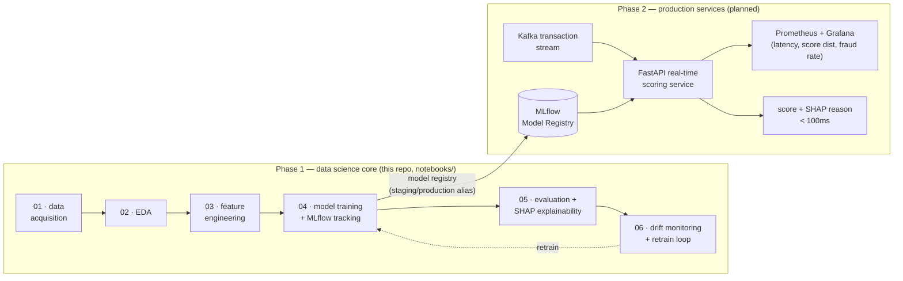

# Real-Time Fraud Detection & Risk Scoring Platform

An end-to-end fraud/risk-scoring system built the way production ML teams (e.g. Stripe
Radar, Sift, Feedzai) actually build them: real transaction data → leakage-safe feature
engineering → tracked model experimentation → business-cost-driven decision thresholds →
SHAP explainability → drift monitoring and an automated retrain-and-validate loop.

## Why fraud detection (not churn / loan default)

Fraud/risk scoring is one of the few ML problem classes that forces you to demonstrate
*every* layer of the stack at once: adversarial, severely imbalanced data; features that
must be computed **causally** (no peeking at the future) because they'll run in a live
scoring path; a decision threshold that has to be justified in dollars, not F1 score; and
monitoring that has to assume the population you're modeling is actively trying to evade
you. It's also not an artificial exercise — Stripe Radar, Sift, and Feedzai all publish
architecture write-ups describing this exact ingestion → feature engineering → training →
deployment → monitoring → retraining loop.

## Data

Real transaction data — the *Credit Card Transactions Fraud Detection Dataset*, originally
published on Kaggle as `kartik2112/fraud-detection` (CC0 1.0), generated with the
open-source **Sparkov Data Generation** tool: ~1,000 simulated customer profiles
transacting against ~700 merchants, with real (non-PCA) fields — timestamp, merchant,
category, amount, and genuine latitude/longitude for both the cardholder and the merchant
on every row. The public mirror this project downloads from (see notebook 01) carries
~1.05M transactions spanning January 2019 – March 2020.

Chosen deliberately over the two more common defaults: the ubiquitous ULB
`creditcard.csv` (features are anonymized PCA components `V1`...`V28`, which kills any
real feature-engineering or SHAP story), and IEEE-CIS Fraud Detection (richer, but gated
behind joining a Kaggle competition). Notebook 01 downloads this dataset from a public,
unauthenticated mirror, so the pipeline runs without a Kaggle account. Full provenance and
license details are documented there.

**Note on demographic fields**: the raw data includes `gender`, `age`, `job`, and
`city_pop`. These are used for descriptive EDA only and are **deliberately excluded** from
the model's feature set — using demographic/socioeconomic proxies in a fraud or credit-risk
model creates real disparate-impact exposure, and a production fraud team would need a
documented governance review before ever using them.

## Project status

**Phase 1 (complete): the data science core**, built and executed as Jupyter notebooks —
see [`notebooks/`](notebooks/). **Phase 2 (planned): production services** — a real-time
FastAPI scoring API, a Kafka-based streaming pipeline, and Prometheus/Grafana monitoring —
see [Roadmap](#roadmap-phase-2-production-services) below.

## Notebooks

| # | Notebook | What it does |
|---|----------|---------------|
| 01 | [`data_acquisition`](notebooks/01_data_acquisition.ipynb) | Downloads and cleans the real Sparkov/kartik2112 transaction dataset, documents provenance/license, builds `users`/`merchants` reference tables, and works out (empirically) which geo signal is actually well-grounded in this data |
| 02 | [`eda`](notebooks/02_eda.ipynb) | Class imbalance, temporal patterns across the real Jan 2019 – Mar 2020 window, amount distributions, merchant-category risk, distance-from-home signal |
| 03 | [`feature_engineering`](notebooks/03_feature_engineering.ipynb) | Leakage-safe, causally-computed features: rolling velocity (1h/24h/7d), expanding amount z-score, category novelty, real distance-from-home, smoothed target encoding for merchant/category risk. Chronological train/val/test split |
| 04 | [`model_training`](notebooks/04_model_training.ipynb) | Class-weighted logistic regression baseline + XGBoost hyperparameter sweep, every run tracked in **MLflow** (SQLite-backed, full Model Registry), best model promoted to the `staging` alias |
| 05 | [`model_evaluation_explainability`](notebooks/05_model_evaluation_explainability.ipynb) | Hold-out test evaluation (ROC-AUC, PR-AUC), a **business-cost-driven decision threshold** (missed-fraud $ loss vs. false-alarm review cost), precision at a fixed daily review budget, recall by category / distance-from-home, and **SHAP** global + individual-transaction explanations |
| 06 | [`drift_monitoring`](notebooks/06_drift_monitoring.ipynb) | PSI/KS-test drift detection on the *real* train→test calendar window, a simulated adversarial shift (a fraud ring adapting to evade the model's top SHAP features), a label-free + performance-based retrain trigger, and an automated retrain → validate → promote step |

## Architecture



## Tech stack

- **Data / features**: pandas, numpy
- **Modeling**: scikit-learn (baseline), XGBoost (production model)
- **Experiment tracking / registry**: MLflow (SQLite backend store)
- **Explainability**: SHAP (TreeExplainer)
- **Monitoring**: PSI / KS-test drift detection (implemented directly, no black-box dependency)
- **Planned (Phase 2)**: FastAPI, Kafka, Docker Compose, Prometheus, Grafana

## Getting started

```bash
python3.11 -m venv venv
source venv/bin/activate
pip install -r requirements.txt

jupyter lab notebooks/
# run 01 -> 06 in order; each depends on artifacts written by the previous one
```

Notebook 01 downloads the ~267MB source CSV on first run (cached locally after that). Each
notebook writes its outputs to `data/raw/`, `data/processed/`, `models/`, `mlruns/` /
`mlflow.db`, and `reports/` — all gitignored (regenerate by re-running the notebooks).

To browse experiment tracking after running notebook 04+:

```bash
mlflow ui --backend-store-uri sqlite:///mlflow.db
```

## Roadmap: Phase 2 (production services)

Not yet built — scoped and architected, pending Docker installation on this machine:

- **`src/api/`** — FastAPI service exposing `POST /score`, loading the model from the
  MLflow Model Registry's `production` alias, returning a score + decision + top SHAP
  reasons in the response, sub-100ms p99 latency target
- **`src/streaming/`** — Kafka producer simulating a live transaction feed, consumer
  wiring it into the scoring service, so the same causal feature logic from notebook 03
  runs incrementally (stateful, per-user) rather than as a batch job
- **`docker/docker-compose.yml`** — Kafka + Zookeeper, the FastAPI service, Prometheus,
  Grafana, and an MLflow tracking server, so the whole platform runs with `docker compose up`
- **`src/monitoring/`** — Prometheus metrics middleware (request latency, prediction-score
  distribution, live fraud rate) + a Grafana dashboard, and notebook 06's PSI/retrain logic
  promoted to a scheduled job
